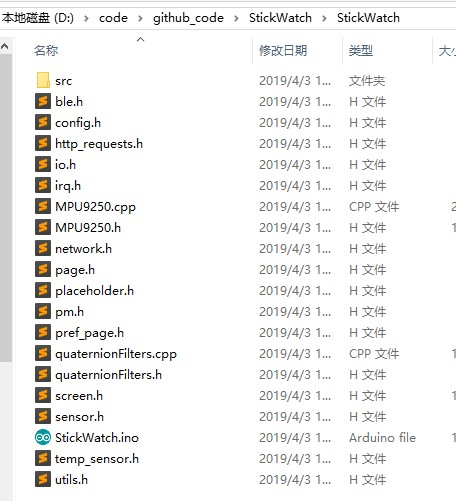
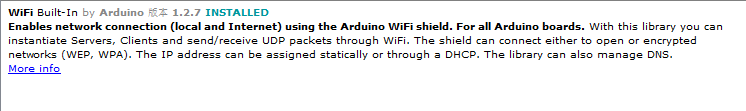
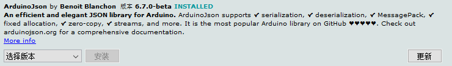

# StickWatch
A smart watch based on M5Stick of ESP32

https://item.taobao.com/item.htm?id=581055502939


Use ESP-idf + Arduino to build this project with configuration:
M5Stack-Core-ESP32, QIO, 80MHz, No OTA (Large APP), 921600, Verbose

以下是例程 StickWatch.ino 的路径



### 在编译 StickWatch.ino 之前，先做以下配置

**1. 为了避免"项目太大了"失败的问题，需要在Arduino IDE中选择菜单栏中的工具->Partition Scheme->Large App No OTA.**

**2. 依赖库（在 Arduino IDE 的板管理上安装以下依赖库）：**
- Wifi

- ArduinoJson (6.2.0-beta as local dependancy)


**3. 配置 WIFI**

为了能正常显示时间，需要配置 WIFI。

打开 config.h 文件，修改第5、6行，修改成您的wifi账号和密码

```arduino
// user configurable variables start
const char* BUILTIN_WIFI_SSID      = "Your WIFI ssid";
const char* BUILTIN_WIFI_PASSWORD  = "********";
```
然后打开 StickWatch.ino，编译下载

### 注意

成功烧录后，Stick 上显示的温度和电压数值都是不可以用，因为没有 Stick 中对应的硬件电路支持
